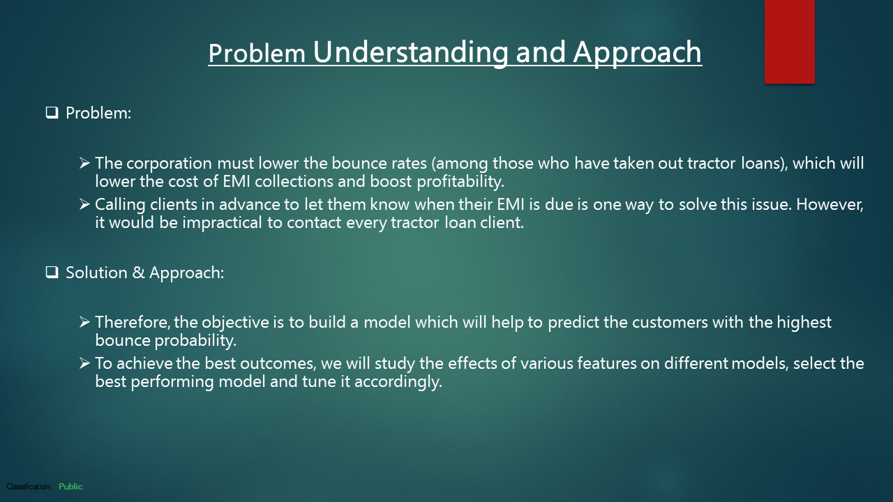
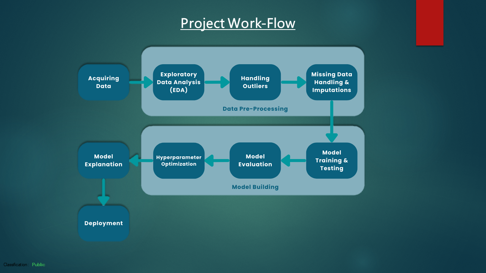
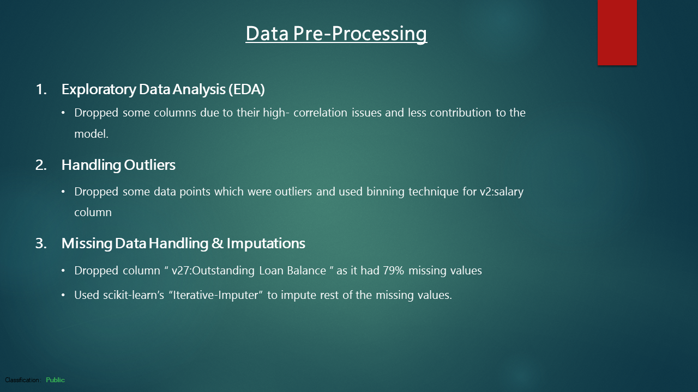
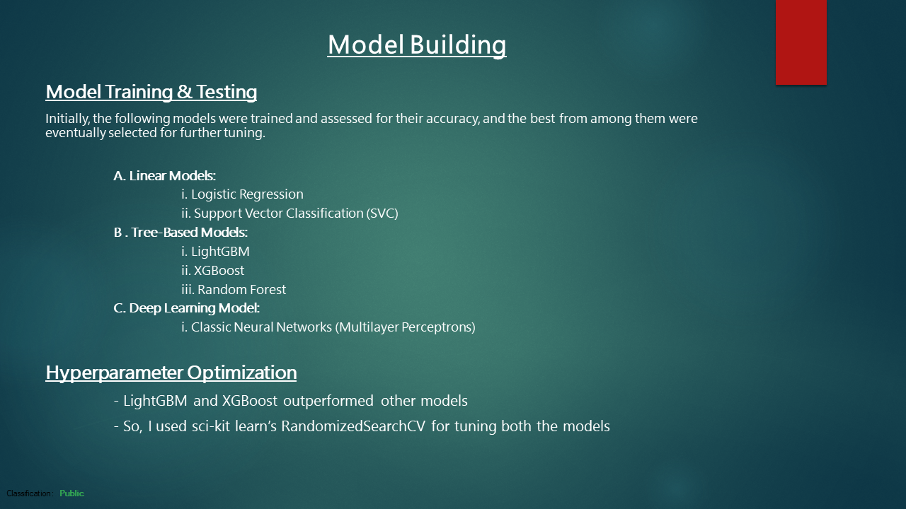
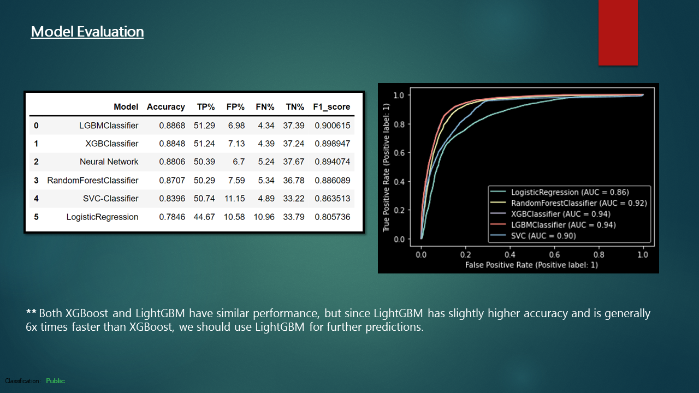
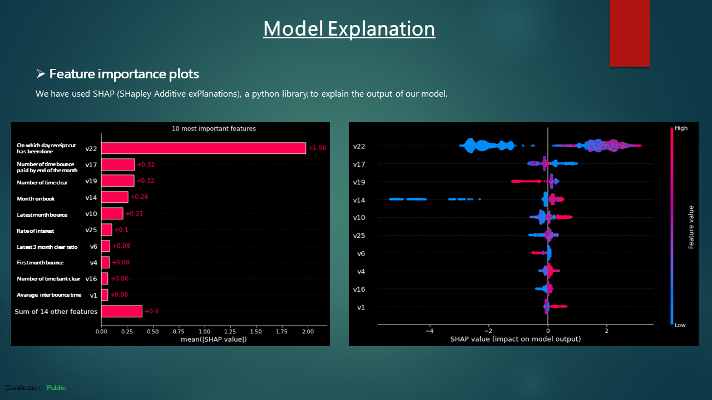
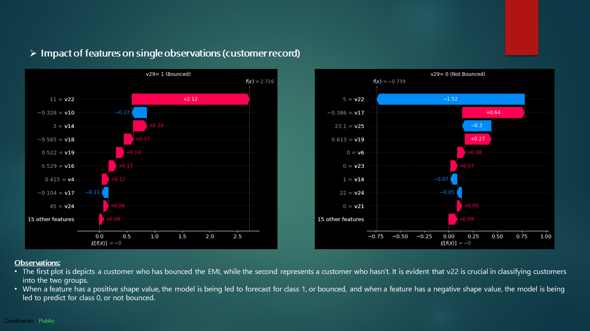
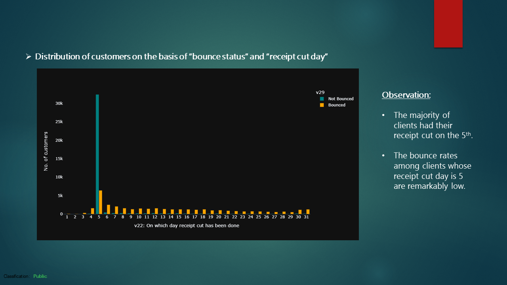
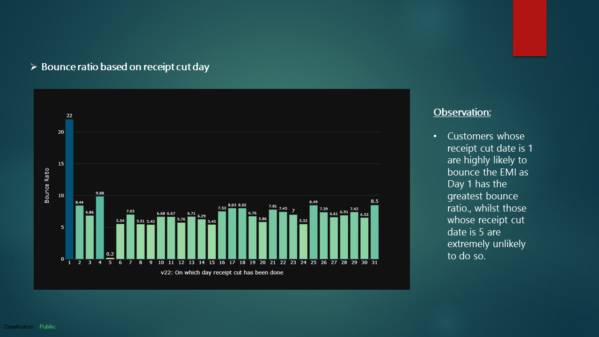
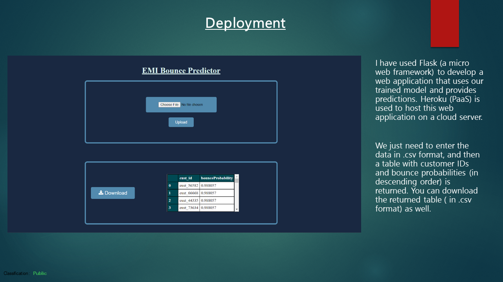

# __EMI Bounce Predictor__

## Table of Contents
- [About](#about)
- [Problem Statement](#problem-statement)
- [Project Workflow](#project-workflow)
- [Data Pre-Processing](#data-pre-processing)
- [Model Building (Training, Testing & Hyperparameter Optimization)](#model-building-training-testing--hyperparameter-optimization)
- [Problem Statement](#problem-statement)
- [Model Evaluation](#project-workflow)
- [Model Explanation using SHAP (SHapley Additive exPlanations)](#model-explanation-using-shap-shapley-additive-explanations)
- [Deployment](#deployment)

## About
- Built a machine learning model to predict which clients are most likely to default on their EMI payments for tractor loans. 
- Preprocessed data, performed EDA, trained and tested various ML models and deployed a web application based on the model on Heroku.
- This project was submitted for TVS Credit E.P.I.C. Analytics Challenge Season 4 (2022).

## Problem Statement

## Project Workflow

## Data Pre-Processing

## Model Building (Training, Testing & Hyperparameter Optimization)

## Model Evaluation

## Model Explanation using SHAP (SHapley Additive exPlanations)

## Deployment

